[](https://github.com/amb-code/amb-feedback-bot/actions/workflows/master.yml)

# AMB Feedback Bot

Telegram-бот для обратной связи команд.

На данный момент бот имеет следующие возможности:
- позволяет анонимно общаться с пользователями в Telegram
- диалог с каждым пользователем ведётся в отдельной теме
- выдача и снятие банов
- редактирование предыдущих сообщений
- управление историей чата: оператор чата может удалять сообщения пользователя 
  или свои собственные, либо полностью очистить историю чата со стороны 
  пользователя
- управление историей данных пользователя: бот уведомляет об изменении полного
  имени или имени пользователя, можно посмотреть полную историю изменений
- мониторинг ошибок через Sentry

<!-- START doctoc generated TOC please keep comment here to allow auto update -->
<!-- DON'T EDIT THIS SECTION, INSTEAD RE-RUN doctoc TO UPDATE -->
**Table of Contents**  *generated with [DocToc](https://github.com/thlorenz/doctoc)*

- [Инструкция по установке бота](#%D0%98%D0%BD%D1%81%D1%82%D1%80%D1%83%D0%BA%D1%86%D0%B8%D1%8F-%D0%BF%D0%BE-%D1%83%D1%81%D1%82%D0%B0%D0%BD%D0%BE%D0%B2%D0%BA%D0%B5-%D0%B1%D0%BE%D1%82%D0%B0)
  - [Создание бота, канала, получение идентификатора чата в Telegram](#%D0%A1%D0%BE%D0%B7%D0%B4%D0%B0%D0%BD%D0%B8%D0%B5-%D0%B1%D0%BE%D1%82%D0%B0-%D0%BA%D0%B0%D0%BD%D0%B0%D0%BB%D0%B0-%D0%BF%D0%BE%D0%BB%D1%83%D1%87%D0%B5%D0%BD%D0%B8%D0%B5-%D0%B8%D0%B4%D0%B5%D0%BD%D1%82%D0%B8%D1%84%D0%B8%D0%BA%D0%B0%D1%82%D0%BE%D1%80%D0%B0-%D1%87%D0%B0%D1%82%D0%B0-%D0%B2-telegram)
  - [Аренда сервера](#%D0%90%D1%80%D0%B5%D0%BD%D0%B4%D0%B0-%D1%81%D0%B5%D1%80%D0%B2%D0%B5%D1%80%D0%B0)
  - [Начальная настройка сервера](#%D0%9D%D0%B0%D1%87%D0%B0%D0%BB%D1%8C%D0%BD%D0%B0%D1%8F-%D0%BD%D0%B0%D1%81%D1%82%D1%80%D0%BE%D0%B9%D0%BA%D0%B0-%D1%81%D0%B5%D1%80%D0%B2%D0%B5%D1%80%D0%B0)
  - [Развертывание бота](#%D0%A0%D0%B0%D0%B7%D0%B2%D0%B5%D1%80%D1%82%D1%8B%D0%B2%D0%B0%D0%BD%D0%B8%D0%B5-%D0%B1%D0%BE%D1%82%D0%B0)
- [Запуск бота](#%D0%97%D0%B0%D0%BF%D1%83%D1%81%D0%BA-%D0%B1%D0%BE%D1%82%D0%B0)
  - [Включение мониторинга](#%D0%92%D0%BA%D0%BB%D1%8E%D1%87%D0%B5%D0%BD%D0%B8%D0%B5-%D0%BC%D0%BE%D0%BD%D0%B8%D1%82%D0%BE%D1%80%D0%B8%D0%BD%D0%B3%D0%B0)
  - [Запуск с docker compose](#%D0%97%D0%B0%D0%BF%D1%83%D1%81%D0%BA-%D1%81-docker-compose)
- [Локальная разработка](#%D0%9B%D0%BE%D0%BA%D0%B0%D0%BB%D1%8C%D0%BD%D0%B0%D1%8F-%D1%80%D0%B0%D0%B7%D1%80%D0%B0%D0%B1%D0%BE%D1%82%D0%BA%D0%B0)
- [Процесс релиза](#%D0%9F%D1%80%D0%BE%D1%86%D0%B5%D1%81%D1%81-%D1%80%D0%B5%D0%BB%D0%B8%D0%B7%D0%B0)

<!-- END doctoc generated TOC please keep comment here to allow auto update -->


## Инструкция по установке бота
Перейдем сразу к делу. Данная инструкция предназначена для пользователей, **не 
обладающих** опытом программирования и развертывания программного обеспечения. 
Мы старались ее настолько простой, насколько это возможно, чтобы команды, которые 
не могут позволить себе услуги дорогостоящих специалистов, могли развернуть бот
самостоятельно.

Однако, стоит иметь в виду несколько вещей:

- Такая установка не оптимальна с точки зрения безопасности, для простоты здесь 
  сделан целый ряд серьезных допущений. Если есть возможность, все же обратитесь 
  к специалисту.

- Руководство предполагает, что вы уверенный пользователь ПК: 
  - понимаете, чем Гугл отличается от Хрома
  - вы хорошо понимаете, что такое вкладка браузера, контролируете, где и что
    открыли, знаете, как вернуться назад
  - имеете представление о том, как выглядят пути на жестком диске и как по ним
    перемещаться
  - готовы рискнуть ввести несколько команд в терминале

- Руководство заточено под хостинг Beget и использует определенный функционал 
  его контрольной панели. Для бота нет разницы, на каком хостинге работать, но
  гарантировать, что у других провайдеров будут такие же инструменты, мы не 
  можем. Опытный пользователь может выбрать любой хостинг на свой вкус, но если 
  вы делаете это в первый раз, не отклоняйтесь от курса.

Если написанное выше вас не отпугнуло, и вы решили отправиться в это 
путешествие, заварите себе кофе, и начнем.


### Создание бота, канала, получение идентификатора чата в Telegram
Для запуска бота вам необходимо выполнить следующее в Telegram:

1. Создайте бот в [@BotFather](https://t.me/BotFather), сохраните `имя бота` и 
   `токен`, они нам понадобятся.

2. Создайте группу, включите топики.

3. Получите ID чата. Для этого нам понадобится бот 
   [@TheGetAnyID_bot](https://t.me/TheGetAnyID_bot). Сначала разрешите своему 
   пользователю в настройках администраторов канала оставаться анонимным.

   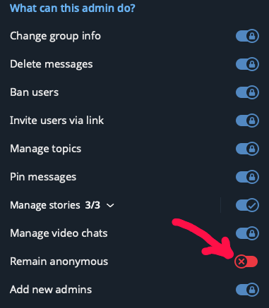

   Опубликуйте любое сообщение от лица канала (вместо вашего имени должно быть 
   имя канала) и перенаправьте его в `@TheGetAnyID_bot`. Бот ответит сообщением 
   следующего вида. Сохраните значение ID.

   ```shell
   ID: -1234567890123
   Name: имя канала
   ```

   Отзовите разрешение своего пользователя оставаться анонимным.

4. Добавьте бота в чат

5. Выдайте ему необходимые разрешения

   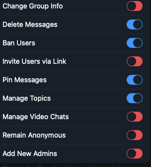


### Аренда сервера
Первое, что нам понадобится – это сервер, на котором будет крутиться бот. Бот не
требователен, и дорогая машина нам не понадобится. Мы будем использовать хостинг
[Beget](https://beget.com). На момент написания самый дешевй сервер стоил 219 
рублей в месяц.

1. Пройдите регистрацию, создайте аккаунт и зайдите в контрольную панель 
   [здесь](https://beget.com/ru). После входа в слева вы увидите кнопку 
   `Create`. Нажмите на нее, выпадет список, где нужно будет выбрать
   `Virtual server`:

   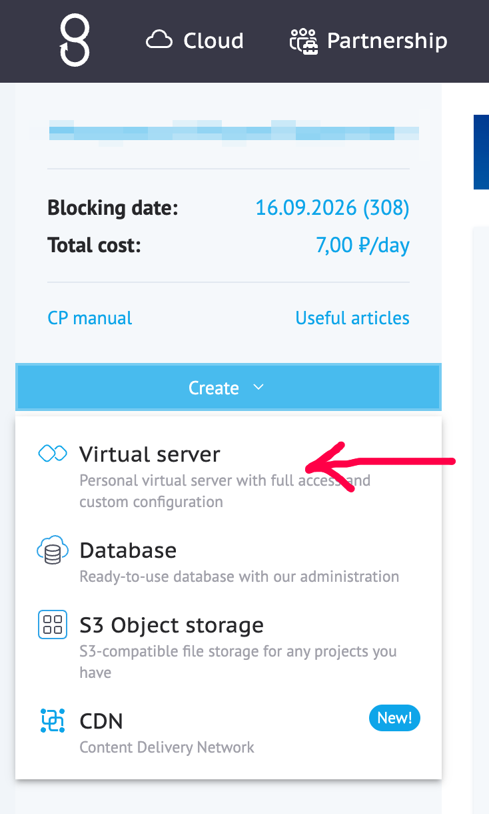

2. Выберите регион и тип сервера. Нам подойдет самый дешевый. Регион на ваше 
   усмотрение.

   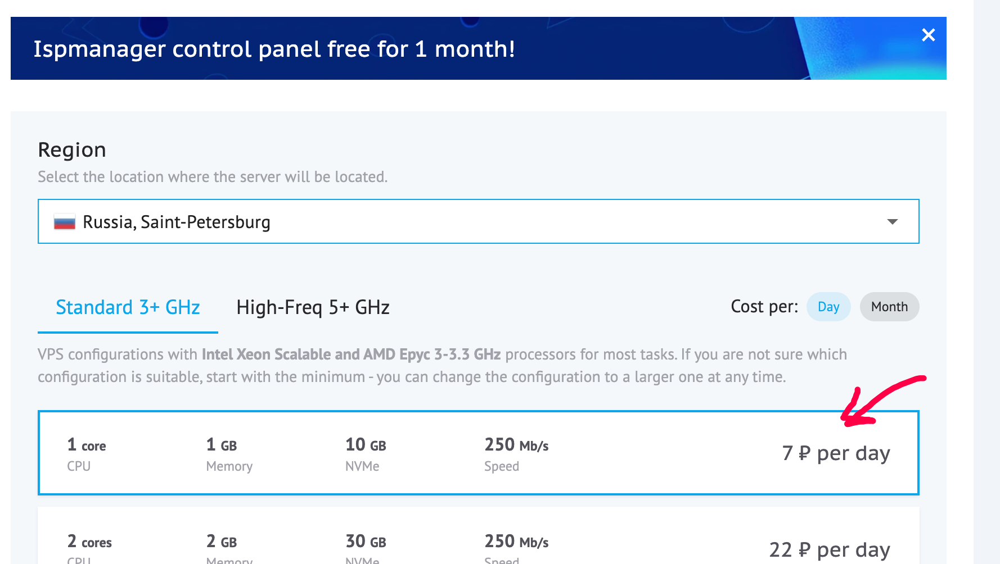

3. В качестве системы выберите Docker.

   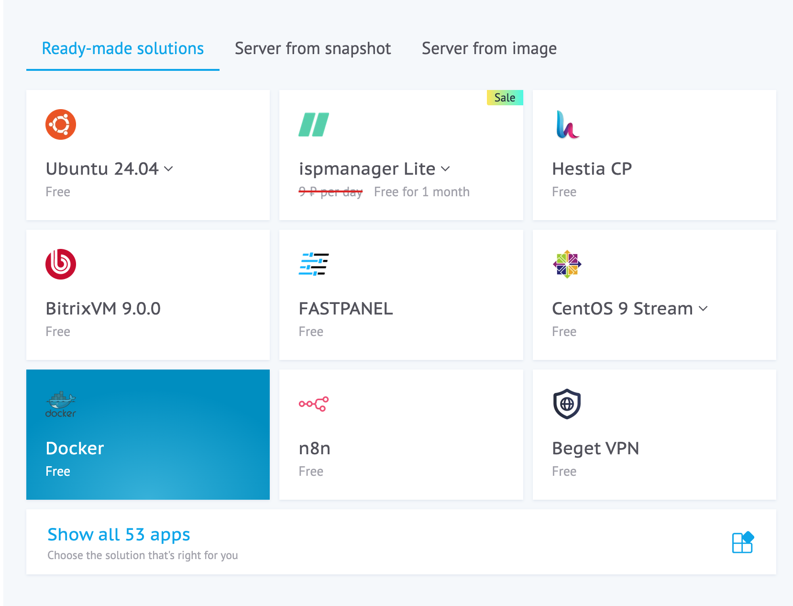

4. Затем в разделе `Authentication` Нужно будет развернуть пункты `Set passowrd`
   и `Additional server parameters`.

   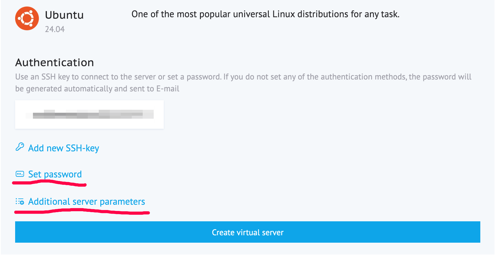

   Должно получиться что-то такое. Поле пароля будет заполнено автоматически. 
   Запишите его и не потеряйте. В качестве имени (Virtual server name) можете 
   ввести что угодно, но вполне подойдет `feedback-bot`, если вы не собираетесь
   использовать этот сервер для чего-либо еще.

   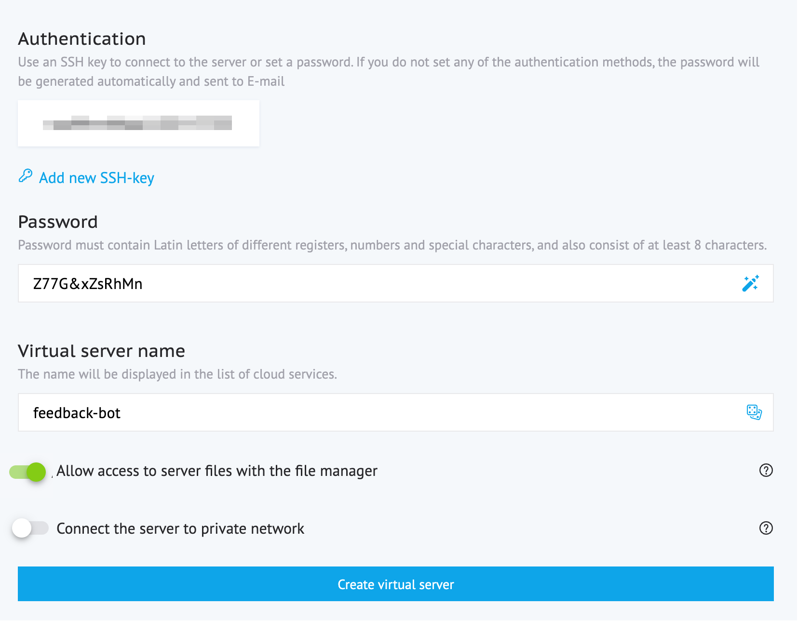

5. Готово, нажимаем кнопку `Create virtual server`. Слева на панели появился 
   только что созданный нами сервер, а справа можно будет увидеть подробности. 
   Обратите внимание на кнопки `Terminal` и `File manager`, она нам понадобится 
   на следующем шаге. 

   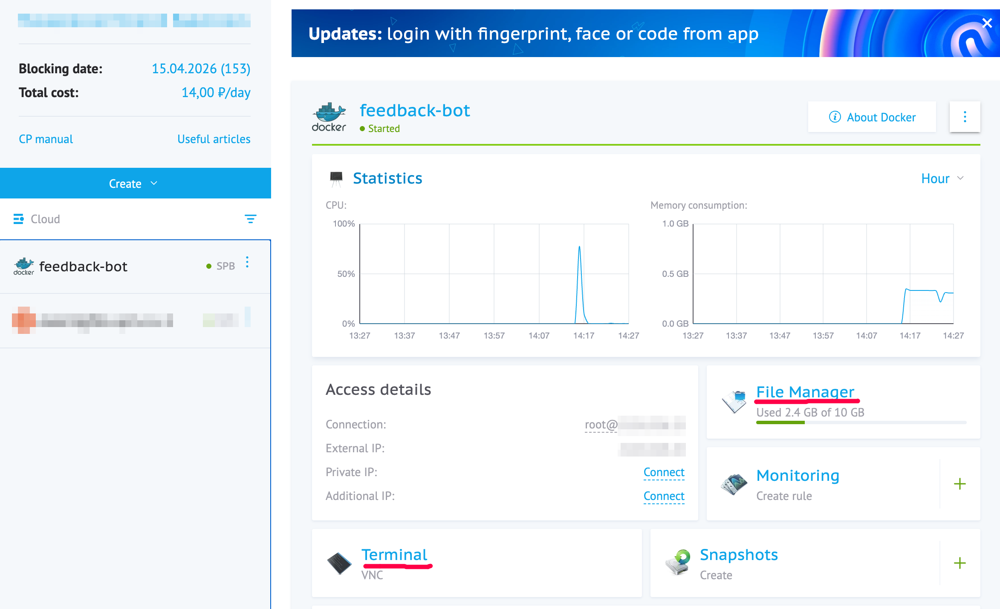


### Начальная настройка сервера
Теперь нам нужно подготовить сервер для работы бота. Нам потребуется пароль, 
который мы записали на прошлом шаге.

1. Теперь пора нажать на кнопку `Terminal`. Откроется окно терминала. 
   В качестве логина вводим `root`.  Затем пароль, который мы записали на 
   предыдущем шаге. Если все прошло успешно, вы увидите что-то такое

   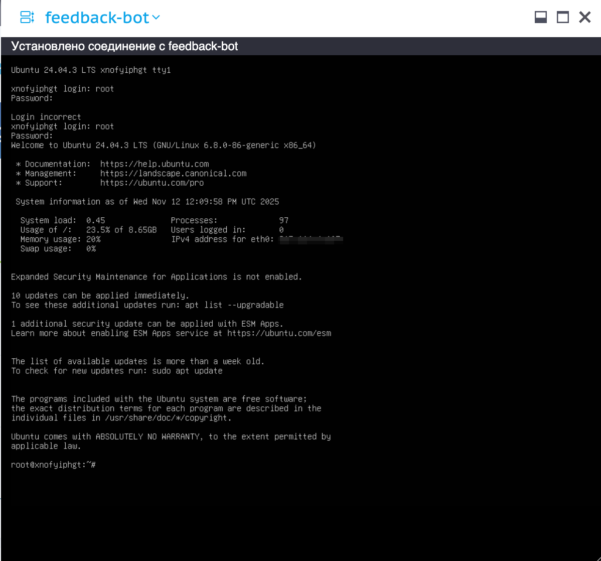

2. Сейчас мы добавим пользователя для `Docker`. От его имени будет запускаться 
   приложение. Вводите команду не спеша. Если вы все сделали правильно, терминал
   ничего не ответит. Иначе вы увидите ошибку.

   ```shell
   useradd -m -g docker docker
   ```


### Развертывание бота
Приготовьтесь, это самая муторная часть.

1. Перейдем в домашнюю папку пользователя, которого мы только что создали.

   ```shell
   cd /home/docker
   ```

2. Теперь нужно скопировать код бота. Нам нужна лишь небольшая часть этих 
   файлов, но для простоты мы скопируем все. Вы увидите что-то такое.

   ```shell
   git clone https://github.com/amb-code/amb-feedback-bot.git
   ```

   Если все в порядке, вы увидите что-то такое:

   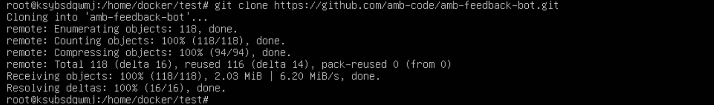

3. Зайдем в только что скопированную папку:

   ```shell
   cd amb-feedback-bot
   ```

4. Создадим файл окружения для `Docker Compose`. Это нужно, чтобы докер смог 
   найти нужную версию бота. Последнюю версию боту вы всегда можете проверить на 
   [странице репозитория](https://github.com/amb-code/amb-feedback-bot), открыв
   выпадающее меню в верхней части страницы и перейдя в раздел `Tags`.

   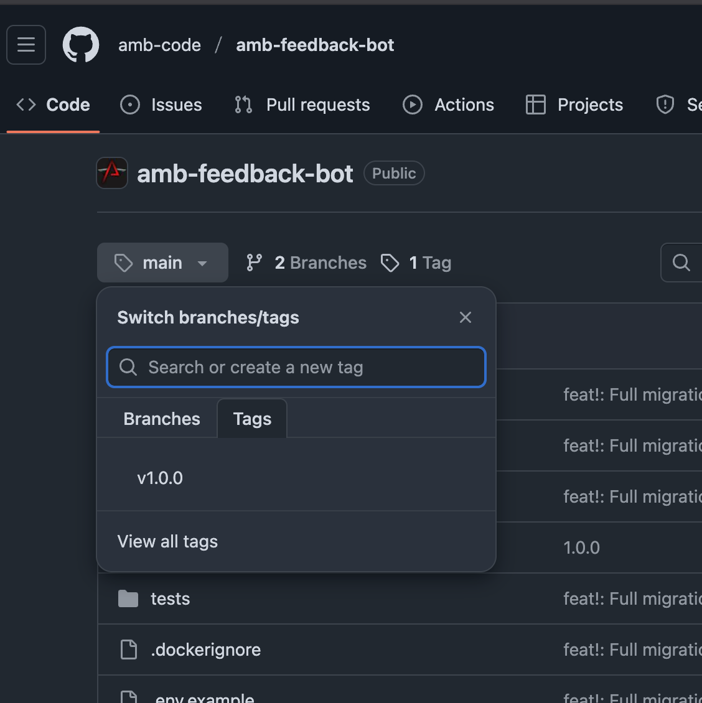

   Введите в терминале

5. ```shell
   nano .env
   ```

   Откроется окно редактора `nano`. Введите следующее содержание, только с 
   последней версией,

   ```dotenv
   TAG=1.0.0
   ```
   Версию нужно указать без `v`. То есть, если на странице репозитория она 
   `v1.0.0`, то вы пишите просто `1.0.0`.

   Нажмите ctrl-x для выхода, ответьте `y` на вопрос, сохранить ли файл. 
   Подтвердите имя для сохранения, оно уже правильное, менять его не надо.

5. Теперь создадим папку `env`, в которой будут лежать уже переменные самого 
   бота. Это более сложная задача, поскольку вводить руками длинные ключи будет 
   сложно, долго, но главное – ненадежно. Поэтому мы создадим их у вас на 
   компьютере, и загрузим через файловый менеджер панели управления Beget.

   Выполните:

   ```shell
   mkdir env
   cd env
   ```

6. Создадим сами файлы с переменными. Если вы на Windows, откройте стандартный 
   `Notepad`. Только когда будете сохранять, убедитесь, что выбрали кодировку
   `UTF-8` внизу рядом с кнопкой сохранения, иначе на Linux могут быть проблемы.

   Создайте на рабочем столе файл `bot.env`:
   ```dotenv
   SETTINGS_MODULE=feedbackbot.settings
   DB_USERNAME=postgres
   DB_PASSWORD=postgres
   DB_HOST=postgres
   DB_PORT=5432
   DB_NAME=feedback_bot
   TG_TOKEN=<токен бота, который вы получили в начале>
   TG_CHAT_ID=<идентификатор чата, что-то такое -1234567890123>
   TG_BOT_USERNAME=<имя, которые вы вабрали при регистрации бота>
   ``` 

   Теперь воздадим `db.env`:
   ```dotenv
   POSTGRES_USER=postgres
   POSTGRES_DB=feedback_bot
   POSTGRES_PASSWORD=postgres
   POSTGRES_HOST=postgres
   POSTGRES_PORT=5432
   ```

7. Сейчас мы загрузим эти файлы в папку `env`, которую создали выше. В шаге 5 
   раздела 
   [Аренда сервера](#%D0%90%D1%80%D0%B5%D0%BD%D0%B4%D0%B0-%D1%81%D0%B5%D1%80%D0%B2%D0%B5%D1%80%D0%B0) 
   мы обращали внимание на кнопку `File manager`. 
   Настало время ее нажать. Откроется файловый менеджер с доступом к диску 
   сервера. Вам нужно будет пройти по пути 
   `home > docker > amb-feedback-bot > env` и нажать кнопку `Загрузить файлы`.
   Затем выберите два файла, что вы создали ранее и загрузите. Если вы все 
   сделали правильно, результат должен выглядеть вот так:

   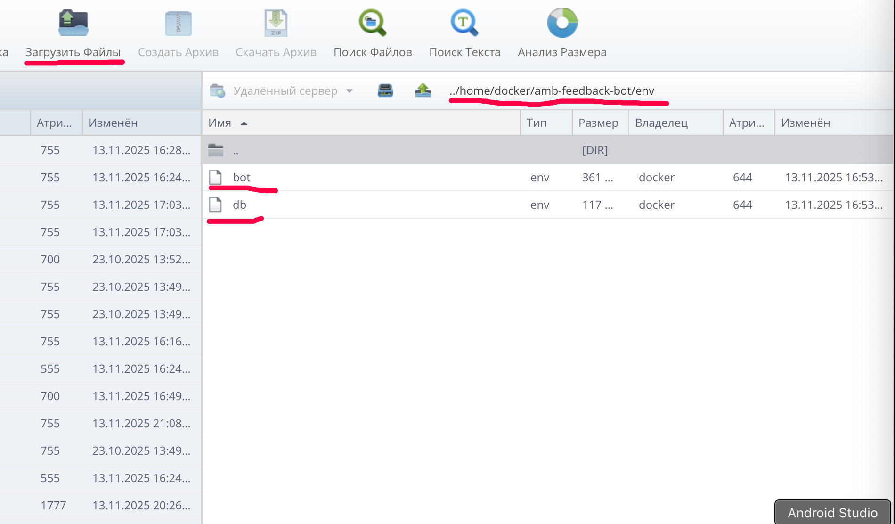

8. Теперь настроим разрешения, необходимые боту для работы. Эта команда настроит
   владельца и группу директории бота.

   ```shell
   chown -R 1000:100 /home/docker/amb-feedback-bot
   ```

9. Теперь запустим бот и проверим, все ли в порядке

   ```shell
   cd home/docker/amb-feedback-bot
   docker compose up -d
   docker compose logs feedback-bot
   ```

   В результате выполнения двух последних команд вы должны увидеть что-то такое.

   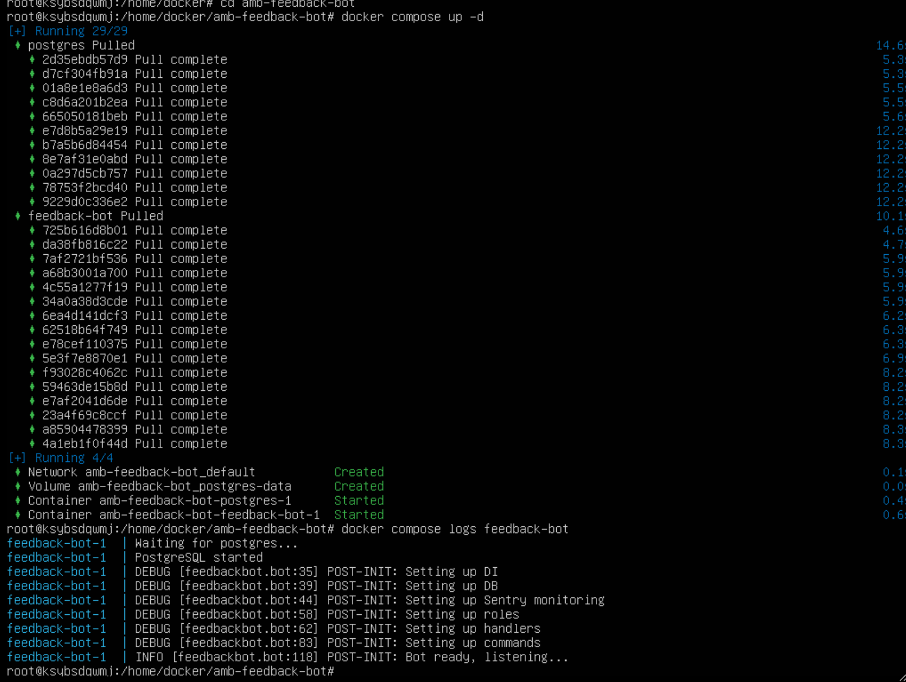

   Если логи бот в конце говорит `Bot ready, listening...`, значит вы все 
   сделали правильно, и пора проверить работоспособность бота.


---
СТАРАЯ ВЕРСИЯ


## Запуск бота


### Включение мониторинга 

Опционально: создать проект Sentry и получить Sentry DSN. Однако это не
обязательно для запуска бота. 

### Запуск с docker compose
- клонировать репозиторий
- создать `db.env` из [db.env.example](env/db.env.example)
- создать `bot.env` из [bot.env.example](env/bot.env.example), используя значения
  из предыдущих шагов 
- запустить `docker compose up -d`


## Локальная разработка

Рекомендуемый способ — использовать virtualenv. Обратите внимание, что соглашения
проекта предполагают хранение venv внутри корня VCS.

Клонировать репозиторий:

    $ git clone git@github.com:amb-code/amb-feedback-bot.git

Создать окружение:

    $ cd amb-feedback-bot
    $ virtualenv -p python3 venv

Установить пакеты для разработки:

    $ source venv/bin/activate
    $ pip install -r requirements.txt
    $ pip install -r requirements-dev.txt

Создать файл .env из [.env.example](.env.example).

Запустить сервер разработки:

    $ python main.py 


## Процесс релиза

- создать feature-ветку
- обновить код и тесты
- открыть PR
- убедиться, что ветка успешно задеплоена, юнит- и интеграционные
  тесты проходят
- смержить PR
