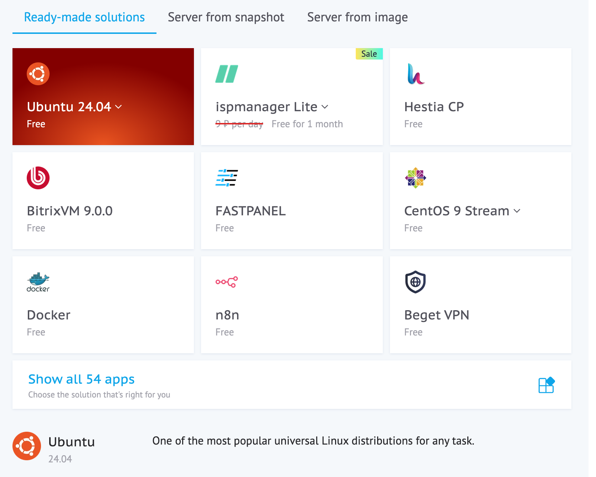

# AMB Feedback Bot

Telegram-бот для обратной связи команд.

На данный момент бот имеет следующие возможности:
- позволяет анонимно общаться с пользователями в Telegram
- диалог с каждым пользователем ведётся в отдельной теме
- выдача и снятие банов
- редактирование предыдущих сообщений
- управление историей чата: оператор чата может удалять сообщения пользователя 
  или свои собственные, либо полностью очистить историю чата со стороны 
  пользователя
- управление историей данных пользователя: бот уведомляет об изменении полного
  имени или имени пользователя, можно посмотреть полную историю изменений
- мониторинг ошибок через Sentry

<!-- START doctoc generated TOC please keep comment here to allow auto update -->
<!-- DON'T EDIT THIS SECTION, INSTEAD RE-RUN doctoc TO UPDATE -->
**Table of Contents**  *generated with [DocToc](https://github.com/thlorenz/doctoc)*
<!-- END doctoc generated TOC please keep comment here to allow auto update -->

## Инструкция по установке бота
Перейдем сразу к делу. Данная инструкция предназначена для пользователей, **не 
обладающих** опытом разработки и развертывания программного обеспечения. Мы 
старались ее настолько простой, насколько это возможно, чтобы команды, которые 
не могут позволить себе услуги дорогостоящих специалистов, могли развернуть бот
самостоятельно. Поэтому заварите себе кофе, сделайте глубокий вдох, и начнем.

### Аренда сервера
Первое, что нам понадобится – это сервер, на котором будет крутиться бот. Бот не
требователен, и дорогая машина нам не понадобится. Мы будем использовать хостинг
[Beget](https://beget.com). На момент написания самый дешевй сервер стоил 219 
рублей в месяц. 

1. Пройдите регистрацию, создайте аккаунт и зайдите в контрольную панель 
   [здесь](https://beget.com/ru). После входа в слева вы увидите кнопку 
   `Create`. Нажмите на нее, выпадет список, где нужно будет выбрать
   `Virtual server`:
   

2. Выберите регион и тип сервера. Нам подойдет самый дешевый. Регион на ваше 
   усмотрение.
   

3. В качестве системы выберите Ubuntu 24.04.
   

4. Затем в разделе `Authentication` Нужно будет развернуть пункты `Set passowrd`
   и `Additional server parameters`.
   

   Должно получиться что-то такое. Поле пароля будет заполнено автоматически. 
   Запишите его и не потеряйте. В качестве имени (Virtual server name) можете 
   ввести что угодно, но вполне подойдет `feedback-bot`, если вы не собираетесь
   использовать этот сервер для чего-либо еще. Галочку 
   `Allow access to server fils with file manager` можно отключить.
   

5. Готово, нажимаем кнопку `Create virtual server`

### Заходим на сервер и подготавливаем его

## Запуск бота

### Предварительные требования Telegram

Для запуска бота вам необходимо выполнить следующее в Telegram:

- Токен бота, который вы получили от [@BotFather](https://t.me/BotFather) при создании бота
- Создать приватную группу
- Получить ID чата: [как получить ID группового чата](https://stackoverflow.com/questions/32423837/telegram-bot-how-to-get-a-group-chat-id)
- Добавить бота в чат
- Выдать ему необходимые разрешения

  

### Включение мониторинга 

Опционально: создать проект Sentry и получить Sentry DSN. Однако это не
обязательно для запуска бота. 

### Запуск с docker compose
- клонировать репозиторий
- создать `db.env` из [db.env.example](env/db.env.example)
- создать `bot.env` из [bot.env.example](env/bot.env.example), используя значения
  из предыдущих шагов 
- запустить `docker compose up -d`

## Локальная разработка

Рекомендуемый способ — использовать virtualenv. Обратите внимание, что соглашения
проекта предполагают хранение venv внутри корня VCS.

Клонировать репозиторий:

    $ git clone git@github.com:amb-code/amb-feedback-bot.git

Создать окружение:

    $ cd amb-feedback-bot
    $ virtualenv -p python3 venv

Установить пакеты для разработки:

    $ source venv/bin/activate
    $ pip install -r requirements.txt
    $ pip install -r requirements-dev.txt

Создать файл .env из [.env.example](.env.example).

Запустить сервер разработки:

    $ python main.py 

## Процесс релиза

- создать feature-ветку
- обновить код и тесты
- открыть PR
- убедиться, что ветка успешно задеплоена, юнит- и интеграционные
  тесты проходят
- смержить PR
